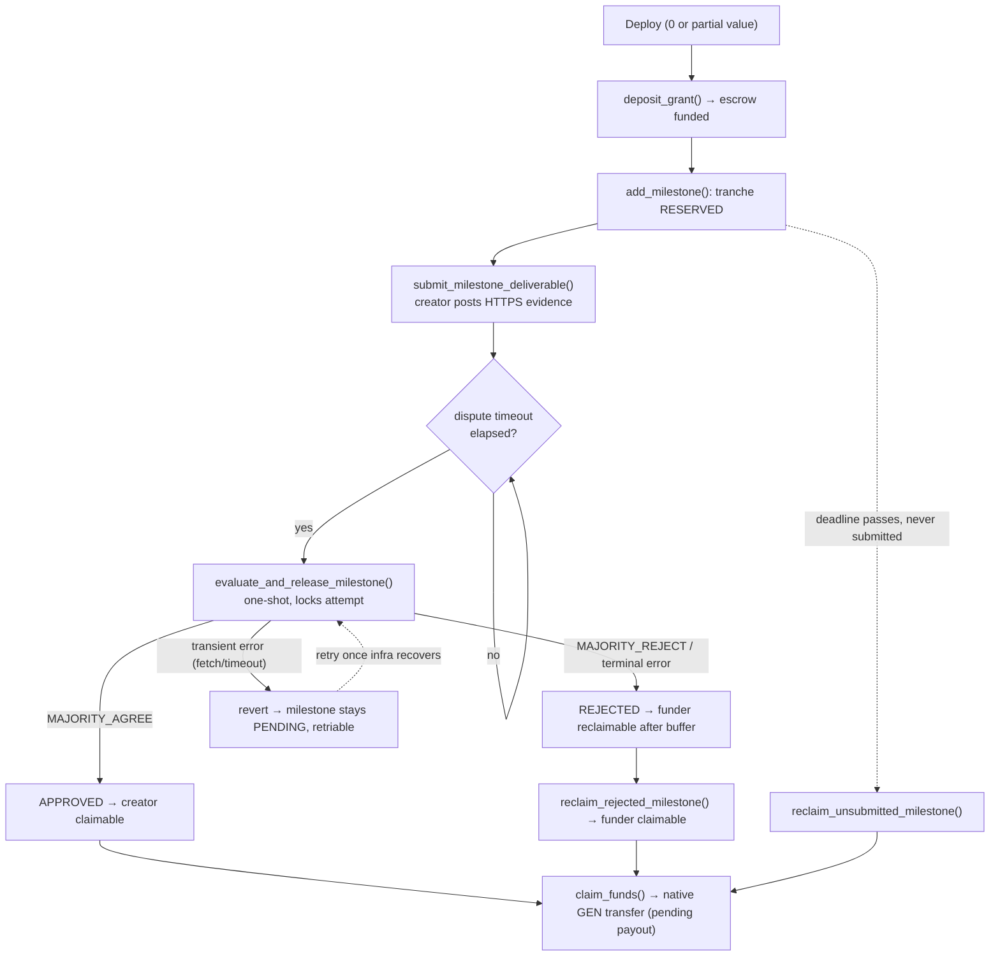

# AIVentureEscrow

> **Autonomous, AI-verified milestone escrow for venture grants — built as a GenLayer Intelligent Contract.**

A funder locks a native **GEN** grant in a contract. A creator delivers work milestone by milestone, submitting a single HTTPS evidence URL for each. Instead of a human gatekeeper, **GenLayer validators independently fetch the evidence and re-run an LLM judgement**, and a milestone only pays out when they *reach consensus* on both the verdict **and** a cryptographic digest of the evidence. Funds move under strict accounting invariants and a pull-payment model that no forged callback can subvert.

- **Contract:** [`contracts/ai_venture_escrow.py`](contracts/ai_venture_escrow.py)
- **Tests:** [`tests/direct/test_ai_venture_escrow.py`](tests/direct/test_ai_venture_escrow.py) — **16 / 16 passing**
- **Frontend:** [`frontend/`](frontend/) — Vite + React + `genlayer-js`

---

## Table of Contents

1. [Why this exists](#1-why-this-exists)
2. [Roles](#2-roles)
3. [Architecture & Lifecycle](#3-architecture--lifecycle)
4. [AI Verification via `gl.nondet`](#4-ai-verification-via-glnondet)
5. [Security Model](#5-security-model)
6. [Accounting Invariants](#6-accounting-invariants)
7. [Contract API](#7-contract-api)
8. [Local Development & Testing](#8-local-development--testing)
9. [Manual Deployment](#9-manual-deployment)
10. [Frontend Configuration](#10-frontend-configuration)
11. [Repository Layout](#11-repository-layout)

---

## 1. Why this exists

Traditional grant escrow needs a trusted arbiter to decide "was this milestone actually delivered?" That arbiter is a bottleneck and a trust assumption. AIVentureEscrow replaces it with **GenLayer's optimistic-democracy consensus over a nondeterministic AI judgement**:

- The **milestone criteria** are committed on-chain as trusted contract data.
- The creator's **submission** (an HTTPS link + description) is untrusted input.
- At evaluation time, **each validator** fetches the live page, runs the same LLM prompt, and votes. Payout requires agreement — a single validator (or a single lucky LLM sample) cannot release funds.

The result is an escrow whose release decision is *reproducible*, *tamper-evident*, and *free of a privileged human referee*.

---

## 2. Roles

| Role | Set by | Powers |
|------|--------|--------|
| **owner** | deployer (`gl.message.sender_address`) | pause, transfer ownership, set admin, set dispute timeout; superset of admin/funder actions |
| **funder** | constructor arg | deposit grant, evaluate, reclaim funds, claim funder payouts |
| **admin** | defaults to `funder`; reassignable by owner | allocate milestones, evaluate |
| **creator** | constructor arg | submit deliverables, claim released tranches |

`funder` and `creator` must be **distinct, non-zero** addresses. The **creator can never evaluate their own work** — even if made admin, `evaluate_and_release_milestone` rejects them explicitly.

---

## 3. Architecture & Lifecycle

The grant is divided into **immutable milestone tranches**. Each tranche flows through a strict state machine. Native GEN is tracked across labelled pools (`escrowed`, `reserved`, `released`, `rejected`, `reclaimed`) so that money is *never double-counted*.



### Key stages

1. **Fund.** Deployment is decoupled from funding (the deploy CLI cannot attach native value). Deploy with `total_grant_amount` as the declared cap and `0` (or partial) value, then call **`deposit_grant()`** with native GEN until the escrow is funded. `funded_amount` tracks GEN actually received; it may never exceed `total_grant_amount`.
2. **Allocate.** The admin calls `add_milestone(id, description, required_proof, amount)`. Each tranche must be **backed by escrowed funds** and sets a submission deadline (`DEFAULT_SUBMISSION_TIMEOUT_SECONDS` = 30 days).
3. **Submit.** The creator calls `submit_milestone_deliverable(id, https_url, description)` **exactly once**. This stamps `submitted_at` and opens a **dispute window** (`evaluation_available_at = submitted_at + dispute_timeout`, default 48h).
4. **Evaluate.** After the dispute window, an evaluator calls `evaluate_and_release_milestone(id)`. This is **one-shot** (see §5) and runs the AI consensus (see §4).
5. **Settle.** On `MAJORITY_AGREE` the tranche becomes claimable by the creator. On an explicit rejection or a terminal error it becomes reclaimable by the funder after a buffer. A **transient** fetch/timeout error instead reverts, leaving the milestone `PENDING` and retriable (see §5). All payouts are **pull-based** (`claim_funds`).

### Timeouts

| Constant | Default | Meaning |
|----------|---------|---------|
| `DEFAULT_DISPUTE_TIMEOUT_SECONDS` | 48h | delay between submission and eligible evaluation |
| `DEFAULT_SUBMISSION_TIMEOUT_SECONDS` | 30 days | deadline for the creator to submit |
| `MIN/MAX_DISPUTE_TIMEOUT_SECONDS` | 1h … 30 days | admin-settable range via `set_dispute_timeout` |

---

## 4. AI Verification via `gl.nondet`

Evaluation happens inside `gl.vm.run_nondet_unsafe(leader_fn, validator_fn)` — GenLayer's primitive for nondeterministic work that must still reach deterministic consensus.

### Leader path (`leader_fn`)
1. **Fetch** the evidence with `gl.nondet.web.render(url, mode="text")`. Network failures raise a `[TRANSIENT]` error.
2. **Sanitize** to ASCII and cap length; compute `evidence_digest = sha256(rendered_text)`.
3. **Build a fenced prompt** and call `gl.nondet.exec_prompt(prompt, response_format="json")`.
4. **Normalize** the model output to `{decision, reason, evidence_digest}` where `decision ∈ {MAJORITY_AGREE, MAJORITY_REJECT}`.

### Validator path (`validator_fn`)
Each validator independently re-runs `leader_fn` and **agrees only if**:
- the leader's result is structurally valid (`_valid_evaluation_result`), **and**
- `decision` matches, **and**
- `evidence_digest` matches **byte-for-byte**.

This means a milestone releases only when validators saw the *same evidence* and reached the *same verdict*. A drifting page, a different LLM sample, or a manipulated result breaks consensus and the transaction does not settle in the creator's favour.

### Prompt-injection hardening

Untrusted submission text and fetched page content are wrapped in **per-evaluation fence tokens** derived from `sha256(requirements ‖ url ‖ evidence)`:

```
-----BEGIN UNTRUSTED EVIDENCE <TOKEN>-----
… untrusted content …
-----END UNTRUSTED EVIDENCE <TOKEN>-----
```

Because the token is unpredictable to the submitter, evidence cannot forge the delimiter to "escape" and issue instructions. The prompt explicitly instructs the model to treat everything inside the fence as *data, never instructions*, and token-collision checks reject any input that happens to contain the token.

### Error taxonomy

Errors are prefixed so validators can agree on *failure* as well as success:

| Prefix | Meaning | Consensus behaviour |
|--------|---------|---------------------|
| `[EXPECTED]` | user/precondition error | validators must reproduce the exact message |
| `[EXTERNAL]` | bad evidence page | validators must reproduce the exact message |
| `[TRANSIENT]` | fetch/LLM unavailable | validators agree if both hit a transient error |
| `[LLM_ERROR]` | malformed model output | rejected |

---

## 5. Security Model

### One-shot evaluation (anti-grinding)
Before entering the nondeterministic block, `evaluate_and_release_milestone` **commits the lock**: it sets `evaluation_locked = True`, `evaluation_attempted = True`, and increments `evaluation_nonce`. An attacker therefore cannot repeatedly re-trigger evaluation to "reroll" for a favourable LLM draw.

Failure handling **distinguishes transient infrastructure errors from terminal outcomes** (steward hardening):

- **Terminal** failures — an explicit `MAJORITY_REJECT`, a deterministic bad-evidence error (`[EXTERNAL]`), or malformed/invalid consensus output (`[LLM_ERROR]`) — **consume** the attempt: the milestone is marked `REJECTED` and becomes funder-reclaimable after the dispute buffer. This preserves anti-grinding: a rejected submission cannot be replayed.
- **Transient** failures — an evidence fetch/timeout that raises `[TRANSIENT]` — **must not** permanently decide the payout. The handler **reverts the whole transaction**, which rolls back the lock, the attempt flag, and the nonce, leaving the milestone `PENDING` and re-evaluable once the infrastructure recovers. No decision was produced, so there is nothing to grind. Classification lives in the pure helper `_is_transient_failure`.

### Checks-Effects-Interactions (CEI)
Every state transition writes **terminal status and all pool accounting first**, and only then emits the native transfer. Concretely:
- Approval sets `APPROVED`, moves funds `reserved → released → escrowed↓`, and **credits `claimable_funds` before any payout** — the transfer itself happens later, in a separate `claim_funds` call.
- Reclaims flip `reclaimed = True` and adjust pools **before** crediting the funder.

### Pull payments + anti-forgery callback protection
Payouts never push GEN inline. Instead:

```
claimable_funds[recipient]  --claim_funds-->  pending_payouts[recipient]  --emit_transfer-->  native GEN
```

`claim_funds` **zeroes the claimable balance and moves it to `pending_payouts` before** emitting `_Payee.emit_transfer`. A malicious or spoofed failure callback (`__on_errored_message__`) **cannot** restore a spent entitlement or mint a second payout — this is directly asserted by:
- `test_forged_error_callback_cannot_restore_creator_payout`
- `test_funder_reclaim_is_pull_payment_and_forged_callback_cannot_restore_it`

> **Design trade-off:** because a failed transfer is *not* auto-credited back, `pending_payouts` for a genuinely failing recipient has no recovery path. This is safe for EOA recipients (the funder/creator set at deploy) and is a deliberate choice favouring anti-forgery over auto-refund.

### Emergency controls
`set_paused(true)` (owner only) halts all state-changing grant operations; `transfer_ownership` and `set_admin` require non-zero addresses.

---

## 6. Accounting Invariants

`_assert_accounting()` runs **after every mutating operation** and reverts the whole transaction if any invariant breaks. Let:

```
total   = total_grant_amount        # declared cap
funded  = funded_amount             # native GEN actually received
```

The enforced invariants are:

```
funded ≤ total
allocated ≤ total
released + reclaimed + unallocated_reclaimed + escrowed  ==  funded     # escrow conservation
released + reclaimed + reserved + rejected               ==  allocated  # milestone conservation
reserved + rejected ≤ escrowed                                          # reservations are backed
Σ(claimable + pending, over creator & funder) == released + reclaimed + unallocated_reclaimed
```

The escrow-conservation invariant balances against **`funded`, not `total`** — this is what makes decoupled funding safe: at every deposit, both `funded` and `escrowed` rise together, so no accounting hole ever opens between deployment and full funding.

---

## 7. Contract API

### Write methods
| Method | Caller | Purpose |
|--------|--------|---------|
| `deposit_grant()` *(value-bearing)* | funder/owner | fund the escrow with native GEN (≤ total) |
| `add_milestone(id, desc, proof, amount)` | admin/owner | allocate an immutable tranche |
| `submit_milestone_deliverable(id, url, desc)` | creator | one-time HTTPS evidence submission |
| `evaluate_and_release_milestone(id)` | owner/funder/admin (not creator) | one-shot AI consensus + release |
| `reclaim_unsubmitted_milestone(id)` | funder/owner | reclaim a tranche whose submission deadline lapsed |
| `reclaim_rejected_milestone(id)` | funder/owner | reclaim a rejected tranche after the buffer |
| `reclaim_unallocated_funds()` | funder/owner | reclaim funded-but-unallocated GEN |
| `claim_funds()` | creator/funder | pull an accrued payout as native GEN |
| `set_paused(bool)` / `set_admin(addr)` / `set_dispute_timeout(s)` / `transfer_ownership(addr)` | owner | administration |

### View methods
`get_grant()` · `get_milestone(id)` · `get_milestone_ids()` · `get_milestone_count()` · `get_locked_balance()`

---

## 8. Local Development & Testing

The test suite runs in **GenLayer direct mode** — it mocks `web.render` and `exec_prompt` (`direct_vm.mock_web` / `mock_llm`) and needs **no running node**.

> ⚠️ **Environment note:** on some setups a bare `pytest` fails at *collection* because globally-installed pytest plugins (`hydra`, `langsmith`, `anyio`) crash under Python 3.14 (`ModuleNotFoundError: typing.io`). This is an environment issue, not a test failure — disable those plugins:

```bash
python3 -m pytest tests/direct/ -q \
  -p no:hydra_pytest -p no:langsmith_plugin -p no:anyio
```

Expected:

```
15 passed
```

The suite covers: exact-funding & role constraints, the decoupled deposit→milestone→claim lifecycle, dispute-timeout gating, approval/rejection/reclaim paths, one-shot enforcement, validator-replay rejection, terminal-failure consumption (unexpected + malformed consensus), and forged-callback protection.

---

## 9. Manual Deployment

Deployment uses the [GenLayer CLI](https://docs.genlayer.com/) (`genlayer`).

```bash
# 1. Select network & account
genlayer network set studionet
genlayer account use <your-account>

# 2. Deploy (native value is NOT required at construction)
genlayer deploy \
  --contract contracts/ai_venture_escrow.py \
  --args addr#<FUNDER_HEX> addr#<CREATOR_HEX> <TOTAL_GRANT_WEI>

# 3. Fund the escrow (value-bearing call)
genlayer write <CONTRACT_ADDRESS> deposit_grant   # attach native GEN

# 4. Sanity-check
genlayer call <CONTRACT_ADDRESS> get_grant
```

> **Important — attaching native value.** The constructor was intentionally relaxed so it deploys with `0` value (the CLI cannot attach `msg.value` at construction). Funding then happens via `deposit_grant()`. That call is **also** value-bearing, so if your tooling cannot attach native GEN to a write, fund the escrow through a value-capable path (the `genlayer-js` SDK / a wallet) rather than the CLI alone. Deployment itself works with zero value.

Verify the deploy actually succeeded by **reading state** (`get_grant`) — a transaction can reach `ACCEPTED`/`FINALIZED` consensus while its constructor *errored*, in which case no contract exists at the address.

---

## 10. Frontend Configuration

The frontend (`frontend/`) is a Vite + React app using `genlayer-js`. The contract address is injected via env — it is **not** hardcoded.

```bash
cd frontend
cp .env.example .env
# edit .env:
#   VITE_CONTRACT_ADDRESS=0x<your deployed address>
#   VITE_GENLAYER_RPC_URL=            # optional custom RPC

npm install
npm run build     # runs `tsc --noEmit` then `vite build`
npm run dev       # local dev server
```

- `src/config.ts` reads `VITE_CONTRACT_ADDRESS`; while it is blank the UI stays in a read-only "not deployed" mode and never invents balances.
- `src/lib/contract.ts` wires reads/writes, wallet connection (EIP-1193), chain switching to Studionet (`61999`), and transaction-status polling.

---

## 11. Repository Layout

```
AIVentureEscrow/
├── contracts/
│   └── ai_venture_escrow.py        # the Intelligent Contract
├── tests/
│   └── direct/
│       ├── conftest.py             # direct-mode fixtures
│       └── test_ai_venture_escrow.py
├── frontend/
│   ├── src/
│   │   ├── config.ts               # network + VITE_CONTRACT_ADDRESS
│   │   ├── lib/contract.ts         # genlayer-js client + tx polling
│   │   ├── hooks/useWallet.ts
│   │   └── App.tsx
│   └── .env.example
└── README.md
```

---

### License

See repository for license terms. Built on [GenLayer](https://www.genlayer.com/).
